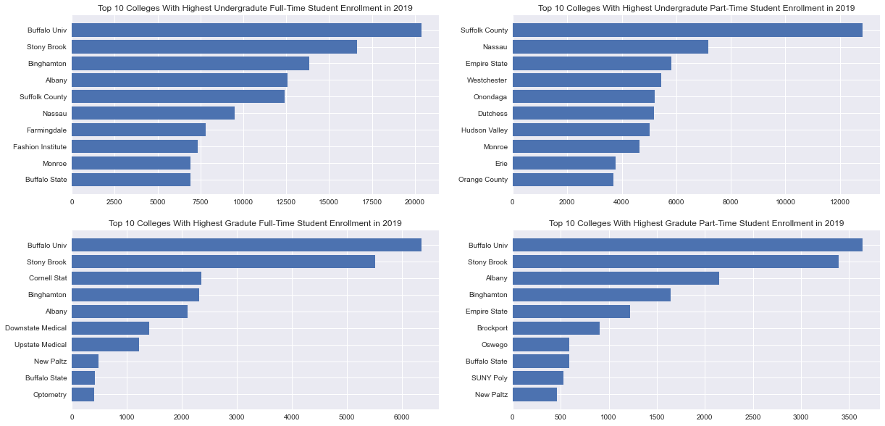
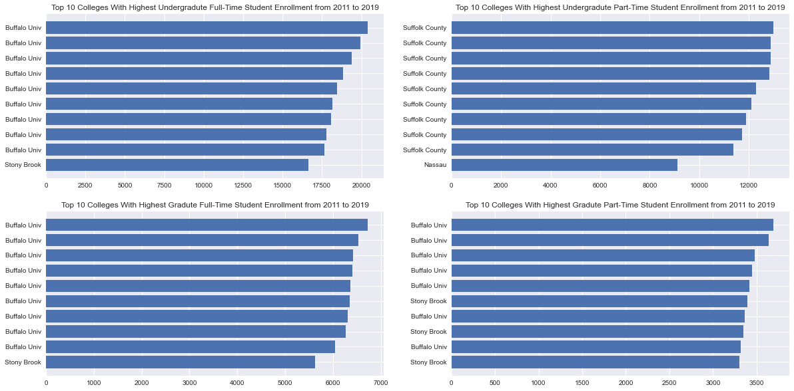

# (2011-2019 College Enrollment Headcount Data in New York - Communicate Data Findings)
## by (Muhammad Megahed)

## Project Description:

> * In this project i will be scraping a csv file from data.gov.
> * That csv contains the enrollment info of full-time and part-time of both undergrad and grad students from 2011 to 2019.
> * I will analyze the data of 2011 and 2019 and provide highlights
> * I will also analyze the data of all the years together and provide highlights.

## Questions:

#### In each of the following: 
> 1. 2011
> 2. 2019
> 3. The period between (2011 and 2019)
#### answer the following questions:
> * What was the record of the highest and lowest number of enrollments in undergraduate full-time students and where was it?
> * What was the record of the highest and lowest number of enrollments in undergraduate part-time students and where was it?
> * What was the record of the highest and lowest number of enrollments in graduate full-time students and where was it?
> * What was the record of the highest and lowest number of enrollments in graduate part-time students and where was it?
> * Who holds the top 10 in each category?


## Part 1: Web Scraping


> * I use beautifulsoup to scrape data.gov up to the point of finding the exact link for the csv file rquired.


```python
import requests
from bs4 import BeautifulSoup
import lxml
```

### 1. Searching data.gov for datasets in csv files


```python
html_text = requests.get('http://catalog.data.gov/dataset?res_format=CSV&page=1').text
soup = BeautifulSoup(html_text, 'lxml')
```

### 2. Printing out total findings


```python
Total_findings = soup.find('div', class_ = "new-results")
print(Total_findings.text.replace('\n', ''))
```

                    24,491 datasets found        
    

### 3. Printing out headlines.


```python
topics = soup.find_all('h3', class_='dataset-heading')
for topic in topics:
    print(f'{topic.text}')
```

    
    2006 - 2011 NYS Math Test Results by Grade - Citywide - by Race-Ethnicity
    
    
    2010-2011 Class Size - District-level Summary
    
    
    2010-2011 Class Size - Borough Summary
    
    
    Appeals Filed In 2017
    
    
    Expense Actuals
    
    
    Capital Grant Awards 2016
    
    
    CMS: LiDAR Data for Forested Areas in Paragominas, Para, Brazil, 2012-2014
    
    
    RapidScat Level 2B Ocean Wind Vectors in 12.5km Slice Composites Version 1.1
    
    
    Homes and Community Renewal Grant Awards:  Beginning 1990
    
    
    Headcount Enrollment by Student Level and Student Load by Institutions of the State University of New York: Beginning Fall 2011
    
    
    Selected Scholarship Programs by Metric Type: Beginning 2014
    
    
    Waterbody Classifications
    
    
    Procurement Report for Local Authorities
    
    
    New York State Enacted Budget Capital Appropriations: 2017-2018
    
    
    Commercial and Non Commercial Flights per Month, Port Authority of NY NJ: Beginning 1977
    
    
    NYC Transit Subway Entrance And Exit Data
    
    
    State Liquor Authority (SLA) Alcoholic Beverage Wet and Dry Local Options: Beginning 1948
    
    
    Environmental Conservation Staff Office Locations
    
    
    Fire Department Directory for New York State
    
    
    Rest Areas Across NY
    
    

### 4. Picking desired dataset.


```python
for topic in topics:
    if 'Headcount' in topic.text:
        print(topic.text)
        link = topic.a['href']
```

    
    Headcount Enrollment by Student Level and Student Load by Institutions of the State University of New York: Beginning Fall 2011
    
    


```python
dataset_link = 'http://catalog.data.gov/' + link
html2_text = requests.get(dataset_link).text
soup2 = BeautifulSoup(html2_text, 'lxml')
```


```python
csv = soup2.find_all('a', class_ = 'btn btn-primary')
for c in csv:
    if 'csv' in c['href']:
        csv_file = c['href']
```


```python
csv_file
```


    'https://data.ny.gov/api/views/4fyc-bf8i/rows.csv?accessType=DOWNLOAD'


## Part 2 & 3: Using NumPy & Pandas for data combining and merging.


```python
import numpy as np
import pandas as pd
import matplotlib.pyplot as plt
import seaborn as sns
```

> * Just in case, the data file can be downloaded from the following link:
> * https://data.ny.gov/api/views/4fyc-bf8i/rows.csv?accessType=DOWNLOAD


```python
# importing the csv file from the link with pandas.

#df = pd.read_csv("Headcount_Enrollment_New_York__Beginning_Fall_2011.csv")
df = pd.read_csv(csv_file)
```


```python
# a general look on the first few rows of the dataframe
df.head()
```


<div>
<style scoped>
    .dataframe tbody tr th:only-of-type {
        vertical-align: middle;
    }

    .dataframe tbody tr th {
        vertical-align: top;
    }

    .dataframe thead th {
        text-align: right;
    }
</style>
<table border="1" class="dataframe">
  <thead>
    <tr style="text-align: right;">
      <th></th>
      <th>Year</th>
      <th>Term</th>
      <th>College or Institution Type</th>
      <th>College or Institution Name</th>
      <th>Undergraduate Full-Time</th>
      <th>Undergraduate Part-Time</th>
      <th>Graduate Full-Time</th>
      <th>Graduate Part-Time</th>
    </tr>
  </thead>
  <tbody>
    <tr>
      <th>0</th>
      <td>2019</td>
      <td>Fall</td>
      <td>Community Colleges</td>
      <td>Adirondack</td>
      <td>1905.0</td>
      <td>1515.0</td>
      <td>NaN</td>
      <td>NaN</td>
    </tr>
    <tr>
      <th>1</th>
      <td>2018</td>
      <td>Fall</td>
      <td>Community Colleges</td>
      <td>Adirondack</td>
      <td>2090.0</td>
      <td>1637.0</td>
      <td>NaN</td>
      <td>NaN</td>
    </tr>
    <tr>
      <th>2</th>
      <td>2017</td>
      <td>Fall</td>
      <td>Community Colleges</td>
      <td>Adirondack</td>
      <td>2189.0</td>
      <td>1703.0</td>
      <td>NaN</td>
      <td>NaN</td>
    </tr>
    <tr>
      <th>3</th>
      <td>2016</td>
      <td>Fall</td>
      <td>Community Colleges</td>
      <td>Adirondack</td>
      <td>2156.0</td>
      <td>1620.0</td>
      <td>NaN</td>
      <td>NaN</td>
    </tr>
    <tr>
      <th>4</th>
      <td>2015</td>
      <td>Fall</td>
      <td>Community Colleges</td>
      <td>Adirondack</td>
      <td>2294.0</td>
      <td>1699.0</td>
      <td>NaN</td>
      <td>NaN</td>
    </tr>
  </tbody>
</table>
</div>


```python
# General info shows that we have a lot of null values in the columns with a float64 data type.
df.info()
```

    <class 'pandas.core.frame.DataFrame'>
    RangeIndex: 549 entries, 0 to 548
    Data columns (total 8 columns):
     #   Column                       Non-Null Count  Dtype  
    ---  ------                       --------------  -----  
     0   Year                         549 non-null    int64  
     1   Term                         549 non-null    object 
     2   College or Institution Type  549 non-null    object 
     3   College or Institution Name  549 non-null    object 
     4   Undergraduate Full-Time      540 non-null    float64
     5   Undergraduate Part-Time      532 non-null    float64
     6   Graduate Full-Time           242 non-null    float64
     7   Graduate Part-Time           230 non-null    float64
    dtypes: float64(4), int64(1), object(3)
    memory usage: 34.4+ KB
    


```python
# general comuptations of the dataframe including mean, min, max and standard deviation.
df.describe()
```


<div>
<style scoped>
    .dataframe tbody tr th:only-of-type {
        vertical-align: middle;
    }

    .dataframe tbody tr th {
        vertical-align: top;
    }

    .dataframe thead th {
        text-align: right;
    }
</style>
<table border="1" class="dataframe">
  <thead>
    <tr style="text-align: right;">
      <th></th>
      <th>Year</th>
      <th>Undergraduate Full-Time</th>
      <th>Undergraduate Part-Time</th>
      <th>Graduate Full-Time</th>
      <th>Graduate Part-Time</th>
    </tr>
  </thead>
  <tbody>
    <tr>
      <th>count</th>
      <td>549.000000</td>
      <td>540.000000</td>
      <td>532.000000</td>
      <td>242.000000</td>
      <td>230.000000</td>
    </tr>
    <tr>
      <th>mean</th>
      <td>2015.000000</td>
      <td>4709.988889</td>
      <td>2038.225564</td>
      <td>905.590909</td>
      <td>642.973913</td>
    </tr>
    <tr>
      <th>std</th>
      <td>2.584344</td>
      <td>3949.670420</td>
      <td>2380.417802</td>
      <td>1547.279804</td>
      <td>921.366400</td>
    </tr>
    <tr>
      <th>min</th>
      <td>2011.000000</td>
      <td>153.000000</td>
      <td>1.000000</td>
      <td>1.000000</td>
      <td>0.000000</td>
    </tr>
    <tr>
      <th>25%</th>
      <td>2013.000000</td>
      <td>1966.500000</td>
      <td>386.250000</td>
      <td>120.000000</td>
      <td>79.250000</td>
    </tr>
    <tr>
      <th>50%</th>
      <td>2015.000000</td>
      <td>3584.500000</td>
      <td>1117.500000</td>
      <td>255.500000</td>
      <td>221.500000</td>
    </tr>
    <tr>
      <th>75%</th>
      <td>2017.000000</td>
      <td>6206.750000</td>
      <td>2887.250000</td>
      <td>1053.500000</td>
      <td>706.250000</td>
    </tr>
    <tr>
      <th>max</th>
      <td>2019.000000</td>
      <td>20401.000000</td>
      <td>12982.000000</td>
      <td>6725.000000</td>
      <td>3691.000000</td>
    </tr>
  </tbody>
</table>
</div>


```python
# sorting the dataframe with the 'Year' column
df = df.sort_values('Year')
```


```python
# creating a new index counting from 0 to 549 and moving the original index into the columns
df = df.reset_index()
```


```python
df.head()
```


<div>
<style scoped>
    .dataframe tbody tr th:only-of-type {
        vertical-align: middle;
    }

    .dataframe tbody tr th {
        vertical-align: top;
    }

    .dataframe thead th {
        text-align: right;
    }
</style>
<table border="1" class="dataframe">
  <thead>
    <tr style="text-align: right;">
      <th></th>
      <th>index</th>
      <th>Year</th>
      <th>Term</th>
      <th>College or Institution Type</th>
      <th>College or Institution Name</th>
      <th>Undergraduate Full-Time</th>
      <th>Undergraduate Part-Time</th>
      <th>Graduate Full-Time</th>
      <th>Graduate Part-Time</th>
    </tr>
  </thead>
  <tbody>
    <tr>
      <th>0</th>
      <td>548</td>
      <td>2011</td>
      <td>Fall</td>
      <td>Community Colleges</td>
      <td>Westchester</td>
      <td>7410.0</td>
      <td>6559.0</td>
      <td>NaN</td>
      <td>NaN</td>
    </tr>
    <tr>
      <th>1</th>
      <td>161</td>
      <td>2011</td>
      <td>Fall</td>
      <td>Technology Colleges</td>
      <td>Delhi</td>
      <td>2607.0</td>
      <td>642.0</td>
      <td>NaN</td>
      <td>NaN</td>
    </tr>
    <tr>
      <th>2</th>
      <td>62</td>
      <td>2011</td>
      <td>Fall</td>
      <td>Community Colleges</td>
      <td>Broome</td>
      <td>4376.0</td>
      <td>1824.0</td>
      <td>NaN</td>
      <td>NaN</td>
    </tr>
    <tr>
      <th>3</th>
      <td>377</td>
      <td>2011</td>
      <td>Fall</td>
      <td>Community Colleges</td>
      <td>North Country</td>
      <td>1124.0</td>
      <td>1330.0</td>
      <td>NaN</td>
      <td>NaN</td>
    </tr>
    <tr>
      <th>4</th>
      <td>170</td>
      <td>2011</td>
      <td>Fall</td>
      <td>Doctoral Degree Granting Institutions</td>
      <td>Downstate Medical</td>
      <td>184.0</td>
      <td>165.0</td>
      <td>1037.0</td>
      <td>365.0</td>
    </tr>
  </tbody>
</table>
</div>


```python
# renaming the index column to 'entry#' for future use
df = df.rename(columns = {'index': 'entry#'})
```


```python
df.head()
```


<div>
<style scoped>
    .dataframe tbody tr th:only-of-type {
        vertical-align: middle;
    }

    .dataframe tbody tr th {
        vertical-align: top;
    }

    .dataframe thead th {
        text-align: right;
    }
</style>
<table border="1" class="dataframe">
  <thead>
    <tr style="text-align: right;">
      <th></th>
      <th>entry#</th>
      <th>Year</th>
      <th>Term</th>
      <th>College or Institution Type</th>
      <th>College or Institution Name</th>
      <th>Undergraduate Full-Time</th>
      <th>Undergraduate Part-Time</th>
      <th>Graduate Full-Time</th>
      <th>Graduate Part-Time</th>
    </tr>
  </thead>
  <tbody>
    <tr>
      <th>0</th>
      <td>548</td>
      <td>2011</td>
      <td>Fall</td>
      <td>Community Colleges</td>
      <td>Westchester</td>
      <td>7410.0</td>
      <td>6559.0</td>
      <td>NaN</td>
      <td>NaN</td>
    </tr>
    <tr>
      <th>1</th>
      <td>161</td>
      <td>2011</td>
      <td>Fall</td>
      <td>Technology Colleges</td>
      <td>Delhi</td>
      <td>2607.0</td>
      <td>642.0</td>
      <td>NaN</td>
      <td>NaN</td>
    </tr>
    <tr>
      <th>2</th>
      <td>62</td>
      <td>2011</td>
      <td>Fall</td>
      <td>Community Colleges</td>
      <td>Broome</td>
      <td>4376.0</td>
      <td>1824.0</td>
      <td>NaN</td>
      <td>NaN</td>
    </tr>
    <tr>
      <th>3</th>
      <td>377</td>
      <td>2011</td>
      <td>Fall</td>
      <td>Community Colleges</td>
      <td>North Country</td>
      <td>1124.0</td>
      <td>1330.0</td>
      <td>NaN</td>
      <td>NaN</td>
    </tr>
    <tr>
      <th>4</th>
      <td>170</td>
      <td>2011</td>
      <td>Fall</td>
      <td>Doctoral Degree Granting Institutions</td>
      <td>Downstate Medical</td>
      <td>184.0</td>
      <td>165.0</td>
      <td>1037.0</td>
      <td>365.0</td>
    </tr>
  </tbody>
</table>
</div>


```python
# checking data types of columns
df.dtypes
```


    entry#                           int64
    Year                             int64
    Term                            object
    College or Institution Type     object
    College or Institution Name     object
    Undergraduate Full-Time        float64
    Undergraduate Part-Time        float64
    Graduate Full-Time             float64
    Graduate Part-Time             float64
    dtype: object


```python
# replacing Null values with 0
df = df.fillna('0')
```


```python
# Creating a dataframe of each year's data

df_2011 = pd.DataFrame(df.loc[df['Year'] == 2011])

df_2012 = pd.DataFrame(df.loc[df['Year'] == 2012])

df_2013 = pd.DataFrame(df.loc[df['Year'] == 2013])

df_2014 = pd.DataFrame(df.loc[df['Year'] == 2014])

df_2015 = pd.DataFrame(df.loc[df['Year'] == 2015])

df_2016 = pd.DataFrame(df.loc[df['Year'] == 2016])

df_2017 = pd.DataFrame(df.loc[df['Year'] == 2017])

df_2018 = pd.DataFrame(df.loc[df['Year'] == 2018])

df_2019 = pd.DataFrame(df.loc[df['Year'] == 2019])
```


## Part 4a: Data Aggregation Highlight

---
---
---
###  1. Analyzing data in the first year 2011


```python
df_2011.head()
```


<div>
<style scoped>
    .dataframe tbody tr th:only-of-type {
        vertical-align: middle;
    }

    .dataframe tbody tr th {
        vertical-align: top;
    }

    .dataframe thead th {
        text-align: right;
    }
</style>
<table border="1" class="dataframe">
  <thead>
    <tr style="text-align: right;">
      <th></th>
      <th>entry#</th>
      <th>Year</th>
      <th>Term</th>
      <th>College or Institution Type</th>
      <th>College or Institution Name</th>
      <th>Undergraduate Full-Time</th>
      <th>Undergraduate Part-Time</th>
      <th>Graduate Full-Time</th>
      <th>Graduate Part-Time</th>
    </tr>
  </thead>
  <tbody>
    <tr>
      <th>0</th>
      <td>548</td>
      <td>2011</td>
      <td>Fall</td>
      <td>Community Colleges</td>
      <td>Westchester</td>
      <td>7410</td>
      <td>6559</td>
      <td>0</td>
      <td>0</td>
    </tr>
    <tr>
      <th>1</th>
      <td>161</td>
      <td>2011</td>
      <td>Fall</td>
      <td>Technology Colleges</td>
      <td>Delhi</td>
      <td>2607</td>
      <td>642</td>
      <td>0</td>
      <td>0</td>
    </tr>
    <tr>
      <th>2</th>
      <td>62</td>
      <td>2011</td>
      <td>Fall</td>
      <td>Community Colleges</td>
      <td>Broome</td>
      <td>4376</td>
      <td>1824</td>
      <td>0</td>
      <td>0</td>
    </tr>
    <tr>
      <th>3</th>
      <td>377</td>
      <td>2011</td>
      <td>Fall</td>
      <td>Community Colleges</td>
      <td>North Country</td>
      <td>1124</td>
      <td>1330</td>
      <td>0</td>
      <td>0</td>
    </tr>
    <tr>
      <th>4</th>
      <td>170</td>
      <td>2011</td>
      <td>Fall</td>
      <td>Doctoral Degree Granting Institutions</td>
      <td>Downstate Medical</td>
      <td>184</td>
      <td>165</td>
      <td>1037</td>
      <td>365</td>
    </tr>
  </tbody>
</table>
</div>


```python
# checking data types in new dataframe
df_2011.dtypes
```


    entry#                          int64
    Year                            int64
    Term                           object
    College or Institution Type    object
    College or Institution Name    object
    Undergraduate Full-Time        object
    Undergraduate Part-Time        object
    Graduate Full-Time             object
    Graduate Part-Time             object
    dtype: object


```python
# changing object data types to numeric
df_2011['Undergraduate Full-Time']= pd.to_numeric(df_2011['Undergraduate Full-Time'],errors='coerce')
df_2011['Undergraduate Part-Time']= pd.to_numeric(df_2011['Undergraduate Part-Time'],errors='coerce')
df_2011['Graduate Full-Time']= pd.to_numeric(df_2011['Graduate Full-Time'],errors='coerce')
df_2011['Graduate Part-Time']= pd.to_numeric(df_2011['Graduate Part-Time'],errors='coerce')
```


```python
# converting the undergrad and grad columns into NumPy arrays to analyze
undergrad_full_2011 = df_2011['Undergraduate Full-Time'].to_numpy(dtype = 'float64')
undergrad_part_2011 = df_2011['Undergraduate Part-Time'].to_numpy(dtype = 'float64')
grad_full_2011 = df_2011['Graduate Full-Time'].to_numpy(dtype = 'float64')
grad_part_2011 = df_2011['Graduate Part-Time'].to_numpy(dtype = 'float64')
```


```python
# finding the maximum undergraduate full-timers in 2011
max_undergrad_full_2011 = np.where(undergrad_full_2011 == np.amax(undergrad_full_2011))[0][0]

# finding the maximum undergraduate part-timers in 2011
max_undergrad_part_2011 = np.where(undergrad_part_2011 == np.amax(undergrad_part_2011))[0][0]

# finding the maximum graduate full-timers in 2011
max_grad_full_2011 = np.where(grad_full_2011 == np.amax(grad_full_2011))[0][0]

# finding the maximum graduate part-timers in 2011
max_grad_part_2011 = np.where(grad_part_2011 == np.amax(grad_part_2011))[0][0]

# finding the minimum undergraduate full-timers in 2011
undergrad_full_2011_min = df_2011[ df_2011['Undergraduate Full-Time'] != 0]
undergrad_full_2011_min = undergrad_full_2011_min['Undergraduate Full-Time'].to_numpy(dtype = 'float64')
min_undergrad_full_2011 = np.where(undergrad_full_2011_min == np.amin(undergrad_full_2011_min))[0][0]

# finding the minimum undergraduate part-timers in 2011
undergrad_part_2011_min = df_2011[ df_2011['Undergraduate Part-Time'] != 0]
undergrad_part_2011_min = undergrad_part_2011_min['Undergraduate Part-Time'].to_numpy(dtype = 'float64')
min_undergrad_part_2011 = df_2011.loc[df_2011['Undergraduate Part-Time'] == undergrad_part_2011_min.min()]
min_undergrad_part_2011 = min_undergrad_part_2011.iloc[0]

# finding the minimum graduate full-timers in 2011
grad_full_2011_min = df_2011[ df_2011['Graduate Full-Time'] != 0]
grad_full_2011_min = grad_full_2011_min['Graduate Full-Time'].to_numpy(dtype = 'float64')
min_grad_full_2011 = df_2011.loc[df_2011['Graduate Full-Time'] == grad_full_2011_min.min()]
min_grad_full_2011 = min_grad_full_2011.iloc[0]

# finding the minimum graduate part-timers in 2011
grad_part_2011_min = df_2011[ df_2011['Graduate Part-Time'] != 0]
grad_part_2011_min = grad_part_2011_min['Graduate Part-Time'].to_numpy(dtype = 'float64')
min_grad_part_2011 = df_2011.loc[df_2011['Graduate Part-Time'] == grad_part_2011_min.min()]
min_grad_part_2011 = min_grad_part_2011.iloc[0]

```


```python
## creating variables for writing conclusion
max_ug_f = df_2011.iloc[max_undergrad_full_2011]['Undergraduate Full-Time']
max_ug_f_cn = df_2011.iloc[max_undergrad_full_2011]['College or Institution Name']
max_ug_f_ct = df_2011.iloc[max_undergrad_full_2011]['College or Institution Type']

max_ug_p = df_2011.iloc[max_undergrad_part_2011]['Undergraduate Part-Time']
max_ug_p_cn = df_2011.iloc[max_undergrad_part_2011]['College or Institution Name']
max_ug_p_ct = df_2011.iloc[max_undergrad_part_2011]['College or Institution Type']

max_g_f = df_2011.iloc[max_grad_full_2011]['Graduate Full-Time']
max_g_f_cn = df_2011.iloc[max_grad_full_2011]['College or Institution Name']
max_g_f_ct = df_2011.iloc[max_grad_full_2011]['College or Institution Type']

max_g_p = df_2011.iloc[max_grad_part_2011]['Graduate Part-Time']
max_g_p_cn = df_2011.iloc[max_grad_part_2011]['College or Institution Name']
max_g_p_ct = df_2011.iloc[max_grad_part_2011]['College or Institution Type']

min_ug_f = df_2011.iloc[min_undergrad_full_2011]['Undergraduate Full-Time'] 
min_ug_f_cn = df_2011.iloc[min_undergrad_full_2011]['College or Institution Name']
min_ug_f_ct = df_2011.iloc[min_undergrad_full_2011]['College or Institution Type']

min_ug_p = min_undergrad_part_2011['Undergraduate Part-Time'] 
min_ug_p_cn = min_undergrad_part_2011['College or Institution Name']
min_ug_p_ct = min_undergrad_part_2011['College or Institution Type']

min_g_f = min_grad_full_2011['Graduate Full-Time']
min_g_f_cn = min_grad_full_2011['College or Institution Name']
min_g_f_ct = min_grad_full_2011['College or Institution Type']

min_g_p = min_grad_part_2011['Graduate Part-Time'] 
min_g_p_cn = min_grad_part_2011['College or Institution Name']
min_g_p_ct = min_grad_part_2011['College or Institution Type']
```


```python
# printing conclusion
print(f'Highest Number of Undergradute Full-Time Students in 2011 is: {max_ug_f} and that was in {max_ug_f_cn} {max_ug_f_ct} \n')
print(f'Highest Number of Undergradute Part-Time Students in 2011 is: {max_ug_p} and that was in {max_ug_p_cn} {max_ug_p_ct} \n')
print(f'Highest Number of Gradute Full-Time Students in 2011 is: {max_g_f} and that was in {max_g_f_cn} {max_g_f_ct} \n')
print(f'Highest Number of Gradute Part-Time Students in 2011 is: {max_g_p} and that was in {max_g_p_cn} {max_g_p_ct} \n\n')

print(f'Lowest Number of Undergradute Full-Time Students in 2011 is: {min_ug_f} and that was in {min_ug_f_cn} {min_ug_f_ct} \n')
print(f'Lowest Number of Undergradute Part-Time Students in 2011 is: {min_ug_p} and that was in {min_ug_p_cn} {min_ug_p_ct} \n')
print(f'Lowest Number of Gradute Full-Time Students in 2011 is: {min_g_f} and that was in {min_g_f_cn} {min_g_f_ct} \n')
print(f'Lowest Number of Gradute Part-Time Students in 2011 is: {min_g_p} and that was in {min_g_p_cn} {min_g_p_ct} \n')
```

    Highest Number of Undergradute Full-Time Students in 2011 is: 17664.0 and that was in Buffalo Univ Doctoral Degree Granting Institutions 
    
    Highest Number of Undergradute Part-Time Students in 2011 is: 11725.0 and that was in Suffolk County Community Colleges 
    
    Highest Number of Gradute Full-Time Students in 2011 is: 6048.0 and that was in Buffalo Univ Doctoral Degree Granting Institutions 
    
    Highest Number of Gradute Part-Time Students in 2011 is: 3478.0 and that was in Buffalo Univ Doctoral Degree Granting Institutions 
    
    
    Lowest Number of Undergradute Full-Time Students in 2011 is: 184.0 and that was in Downstate Medical Doctoral Degree Granting Institutions 
    
    Lowest Number of Undergradute Part-Time Students in 2011 is: 17.0 and that was in Alfred-Ceramics Doctoral Degree Granting Institutions 
    
    Lowest Number of Gradute Full-Time Students in 2011 is: 71.0 and that was in Alfred-Ceramics Doctoral Degree Granting Institutions 
    
    Lowest Number of Gradute Part-Time Students in 2011 is: 2.0 and that was in Optometry Doctoral Degree Granting Institutions 
    
    

---
---
---
###  2. Analyzing data in the last year 2019


```python
## general look on the first few rows.
df_2019.head()
```


<div>
<style scoped>
    .dataframe tbody tr th:only-of-type {
        vertical-align: middle;
    }

    .dataframe tbody tr th {
        vertical-align: top;
    }

    .dataframe thead th {
        text-align: right;
    }
</style>
<table border="1" class="dataframe">
  <thead>
    <tr style="text-align: right;">
      <th></th>
      <th>entry#</th>
      <th>Year</th>
      <th>Term</th>
      <th>College or Institution Type</th>
      <th>College or Institution Name</th>
      <th>Undergraduate Full-Time</th>
      <th>Undergraduate Part-Time</th>
      <th>Graduate Full-Time</th>
      <th>Graduate Part-Time</th>
    </tr>
  </thead>
  <tbody>
    <tr>
      <th>488</th>
      <td>324</td>
      <td>2019</td>
      <td>Fall</td>
      <td>Community Colleges</td>
      <td>Monroe</td>
      <td>6927</td>
      <td>4645</td>
      <td>0</td>
      <td>0</td>
    </tr>
    <tr>
      <th>489</th>
      <td>270</td>
      <td>2019</td>
      <td>Fall</td>
      <td>Community Colleges</td>
      <td>Herkimer County</td>
      <td>1268</td>
      <td>1128</td>
      <td>0</td>
      <td>0</td>
    </tr>
    <tr>
      <th>490</th>
      <td>216</td>
      <td>2019</td>
      <td>Fall</td>
      <td>Community Colleges</td>
      <td>Fashion Institute</td>
      <td>7340</td>
      <td>1168</td>
      <td>165</td>
      <td>53</td>
    </tr>
    <tr>
      <th>491</th>
      <td>333</td>
      <td>2019</td>
      <td>Fall</td>
      <td>Technology Colleges</td>
      <td>Morrisville</td>
      <td>2283</td>
      <td>498</td>
      <td>0</td>
      <td>0</td>
    </tr>
    <tr>
      <th>492</th>
      <td>513</td>
      <td>2019</td>
      <td>Fall</td>
      <td>Community Colleges</td>
      <td>Tompkins Cortland</td>
      <td>1460</td>
      <td>743</td>
      <td>0</td>
      <td>0</td>
    </tr>
  </tbody>
</table>
</div>


```python
## general look on the data types.
df_2019.dtypes
```


    entry#                          int64
    Year                            int64
    Term                           object
    College or Institution Type    object
    College or Institution Name    object
    Undergraduate Full-Time        object
    Undergraduate Part-Time        object
    Graduate Full-Time             object
    Graduate Part-Time             object
    dtype: object


```python
# changing object data types to numeric
df_2019['Undergraduate Full-Time']= pd.to_numeric(df_2019['Undergraduate Full-Time'],errors='coerce')
df_2019['Undergraduate Part-Time']= pd.to_numeric(df_2019['Undergraduate Part-Time'],errors='coerce')
df_2019['Graduate Full-Time']= pd.to_numeric(df_2019['Graduate Full-Time'],errors='coerce')
df_2019['Graduate Part-Time']= pd.to_numeric(df_2019['Graduate Part-Time'],errors='coerce')
```


```python
# converting the undergrad and grad columns into NumPy arrays to analyze
undergrad_full_2019 = df_2019['Undergraduate Full-Time'].to_numpy(dtype = 'float64')
undergrad_part_2019 = df_2019['Undergraduate Part-Time'].to_numpy(dtype = 'float64')
grad_full_2019 = df_2019['Graduate Full-Time'].to_numpy(dtype = 'float64')
grad_part_2019 = df_2019['Graduate Part-Time'].to_numpy(dtype = 'float64')
```


```python
# finding the maximum undergraduate full-timers in 2019
max_undergrad_full_2019 = np.where(undergrad_full_2019 == np.amax(undergrad_full_2019))[0][0]

# finding the maximum undergraduate part-timers in 2019
max_undergrad_part_2019 = np.where(undergrad_part_2019 == np.amax(undergrad_part_2019))[0][0]

# finding the maximum graduate full-timers in 2019
max_grad_full_2019 = np.where(grad_full_2019 == np.amax(grad_full_2019))[0][0]

# finding the maximum graduate part-timers in 2019
max_grad_part_2019 = np.where(grad_part_2019 == np.amax(grad_part_2019))[0][0]

# finding the minimum undergraduate full-timers in 2019
undergrad_full_2019_min = df_2019[ df_2019['Undergraduate Full-Time'] != 0]
undergrad_full_2019_min = undergrad_full_2019_min['Undergraduate Full-Time'].to_numpy(dtype = 'float64')
min_undergrad_full_2019 = np.where(undergrad_full_2019_min == np.amin(undergrad_full_2019_min))[0][0]

# finding the minimum undergraduate part-timers in 2019
undergrad_part_2019_min = df_2019[ df_2019['Undergraduate Part-Time'] != 0]
undergrad_part_2019_min = undergrad_part_2019_min['Undergraduate Part-Time'].to_numpy(dtype = 'float64')
min_undergrad_part_2019 = df_2019.loc[df_2019['Undergraduate Part-Time'] == undergrad_part_2019_min.min()]
min_undergrad_part_2019 = min_undergrad_part_2019.iloc[0]

# finding the minimum graduate full-timers in 2019
grad_full_2019_min = df_2019[ df_2019['Graduate Full-Time'] != 0]
grad_full_2019_min = grad_full_2019_min['Graduate Full-Time'].to_numpy(dtype = 'float64')
min_grad_full_2019 = df_2019.loc[df_2019['Graduate Full-Time'] == grad_full_2019_min.min()]
min_grad_full_2019 = min_grad_full_2019.iloc[0]

# finding the minimum graduate part-timers in 2019
grad_part_2019_min = df_2019[ df_2019['Graduate Part-Time'] != 0]
grad_part_2019_min = grad_part_2019_min['Graduate Part-Time'].to_numpy(dtype = 'float64')
min_grad_part_2019 = df_2019.loc[df_2019['Graduate Part-Time'] == grad_part_2019_min.min()]
min_grad_part_2019 = min_grad_part_2019.iloc[0]

```


```python
## creating variables for writing conclusion
max_ug_f_19 = df_2019.iloc[max_undergrad_full_2019]['Undergraduate Full-Time']
max_ug_f_cn_19 = df_2019.iloc[max_undergrad_full_2019]['College or Institution Name']
max_ug_f_ct_19 = df_2019.iloc[max_undergrad_full_2019]['College or Institution Type']

max_ug_p_19 = df_2019.iloc[max_undergrad_part_2019]['Undergraduate Part-Time']
max_ug_p_cn_19 = df_2019.iloc[max_undergrad_part_2019]['College or Institution Name']
max_ug_p_ct_19 = df_2019.iloc[max_undergrad_part_2019]['College or Institution Type']

max_g_f_19 = df_2019.iloc[max_grad_full_2019]['Graduate Full-Time']
max_g_f_cn_19 = df_2019.iloc[max_grad_full_2019]['College or Institution Name']
max_g_f_ct_19 = df_2019.iloc[max_grad_full_2019]['College or Institution Type']

max_g_p_19 = df_2019.iloc[max_grad_part_2019]['Graduate Part-Time']
max_g_p_cn_19 = df_2019.iloc[max_grad_part_2019]['College or Institution Name']
max_g_p_ct_19 = df_2019.iloc[max_grad_part_2019]['College or Institution Type']

min_ug_f_19 = df_2019.iloc[min_undergrad_full_2019]['Undergraduate Full-Time'] 
min_ug_f_cn_19 = df_2019.iloc[min_undergrad_full_2019]['College or Institution Name']
min_ug_f_ct_19 = df_2019.iloc[min_undergrad_full_2019]['College or Institution Type']

min_ug_p_19 = min_undergrad_part_2019['Undergraduate Part-Time'] 
min_ug_p_cn_19 = min_undergrad_part_2019['College or Institution Name']
min_ug_p_ct_19 = min_undergrad_part_2019['College or Institution Type']

min_g_f_19 = min_grad_full_2019['Graduate Full-Time']
min_g_f_cn_19 = min_grad_full_2019['College or Institution Name']
min_g_f_ct_19 = min_grad_full_2019['College or Institution Type']

min_g_p_19 = min_grad_part_2019['Graduate Part-Time'] 
min_g_p_cn_19 = min_grad_part_2019['College or Institution Name']
min_g_p_ct_19 = min_grad_part_2019['College or Institution Type']
```


```python
# printing conclusion
print(f'Highest Number of Undergradute Full-Time Students in 2019 is: {max_ug_f_19} and that was in {max_ug_f_cn_19} {max_ug_f_ct_19} \n')
print(f'Highest Number of Undergradute Part-Time Students in 2019 is: {max_ug_p_19} and that was in {max_ug_p_cn_19} {max_ug_p_ct_19} \n')
print(f'Highest Number of Gradute Full-Time Students in 2019 is: {max_g_f_19} and that was in {max_g_f_cn_19} {max_g_f_ct_19} \n')
print(f'Highest Number of Gradute Part-Time Students in 2019 is: {max_g_p_19} and that was in {max_g_p_cn_19} {max_g_p_ct_19} \n\n')

print(f'Lowest of Undergradute Full-Time Students in 2019 is: {min_ug_f_19} and that was in {min_ug_f_cn_19} {min_ug_f_ct_19} \n')
print(f'Lowest of Undergradute Part-Time Students in 2019 is: {min_ug_p_19} and that was in {min_ug_p_cn_19} {min_ug_p_ct_19} \n')
print(f'Lowest of Gradute Full-Time Students in 2019 is: {min_g_f_19} and that was in {min_g_f_cn_19} {min_g_f_ct_19} \n')
print(f'Lowest of Gradute Part-Time Students in 2019 is: {min_g_p_19} and that was in {min_g_p_cn_19} {min_g_p_ct_19} \n')
```

    Highest Number of Undergradute Full-Time Students in 2019 is: 20401.0 and that was in Buffalo Univ Doctoral Degree Granting Institutions 
    
    Highest Number of Undergradute Part-Time Students in 2019 is: 12831.0 and that was in Suffolk County Community Colleges 
    
    Highest Number of Gradute Full-Time Students in 2019 is: 6361.0 and that was in Buffalo Univ Doctoral Degree Granting Institutions 
    
    Highest Number of Gradute Part-Time Students in 2019 is: 3641.0 and that was in Buffalo Univ Doctoral Degree Granting Institutions 
    
    
    Lowest of Undergradute Full-Time Students in 2019 is: 153.0 and that was in Upstate Medical Doctoral Degree Granting Institutions 
    
    Lowest of Undergradute Part-Time Students in 2019 is: 1.0 and that was in Cornell Stat Doctoral Degree Granting Institutions 
    
    Lowest of Gradute Full-Time Students in 2019 is: 10.0 and that was in Delhi Technology Colleges 
    
    Lowest of Gradute Part-Time Students in 2019 is: 9.0 and that was in Purchase Comprehensive Colleges 
    
    

---
---
---
###  3. Gathering data from the entire dataframe


```python
## General look on the first few rows.
df.head()
```


<div>
<style scoped>
    .dataframe tbody tr th:only-of-type {
        vertical-align: middle;
    }

    .dataframe tbody tr th {
        vertical-align: top;
    }

    .dataframe thead th {
        text-align: right;
    }
</style>
<table border="1" class="dataframe">
  <thead>
    <tr style="text-align: right;">
      <th></th>
      <th>entry#</th>
      <th>Year</th>
      <th>Term</th>
      <th>College or Institution Type</th>
      <th>College or Institution Name</th>
      <th>Undergraduate Full-Time</th>
      <th>Undergraduate Part-Time</th>
      <th>Graduate Full-Time</th>
      <th>Graduate Part-Time</th>
    </tr>
  </thead>
  <tbody>
    <tr>
      <th>0</th>
      <td>548</td>
      <td>2011</td>
      <td>Fall</td>
      <td>Community Colleges</td>
      <td>Westchester</td>
      <td>7410</td>
      <td>6559</td>
      <td>0</td>
      <td>0</td>
    </tr>
    <tr>
      <th>1</th>
      <td>161</td>
      <td>2011</td>
      <td>Fall</td>
      <td>Technology Colleges</td>
      <td>Delhi</td>
      <td>2607</td>
      <td>642</td>
      <td>0</td>
      <td>0</td>
    </tr>
    <tr>
      <th>2</th>
      <td>62</td>
      <td>2011</td>
      <td>Fall</td>
      <td>Community Colleges</td>
      <td>Broome</td>
      <td>4376</td>
      <td>1824</td>
      <td>0</td>
      <td>0</td>
    </tr>
    <tr>
      <th>3</th>
      <td>377</td>
      <td>2011</td>
      <td>Fall</td>
      <td>Community Colleges</td>
      <td>North Country</td>
      <td>1124</td>
      <td>1330</td>
      <td>0</td>
      <td>0</td>
    </tr>
    <tr>
      <th>4</th>
      <td>170</td>
      <td>2011</td>
      <td>Fall</td>
      <td>Doctoral Degree Granting Institutions</td>
      <td>Downstate Medical</td>
      <td>184</td>
      <td>165</td>
      <td>1037</td>
      <td>365</td>
    </tr>
  </tbody>
</table>
</div>


```python
## Inspecting datatypes.
df.dtypes
```


    entry#                          int64
    Year                            int64
    Term                           object
    College or Institution Type    object
    College or Institution Name    object
    Undergraduate Full-Time        object
    Undergraduate Part-Time        object
    Graduate Full-Time             object
    Graduate Part-Time             object
    dtype: object


```python
# changing object data types to numeric using pandas.
df['Undergraduate Full-Time']= pd.to_numeric(df['Undergraduate Full-Time'],errors='coerce')
df['Undergraduate Part-Time']= pd.to_numeric(df['Undergraduate Part-Time'],errors='coerce')
df['Graduate Full-Time']= pd.to_numeric(df['Graduate Full-Time'],errors='coerce')
df['Graduate Part-Time']= pd.to_numeric(df['Graduate Part-Time'],errors='coerce')
```


```python
### Highest and lowest values of undergraduate and gradute full-time students' enrollment:


highest_undergrad_full = df.sort_values('Undergraduate Full-Time').tail(1)
highest_ugf_num = highest_undergrad_full.iloc[0]['Undergraduate Full-Time']
highest_ugf_college = highest_undergrad_full.iloc[0]['College or Institution Name']
highest_ugf_year = highest_undergrad_full.iloc[0]['Year']
highest_ugf_row_num = highest_undergrad_full.iloc[0]['entry#']

lowest_undergrad_full = df[df['Undergraduate Full-Time'] != 0].sort_values('Undergraduate Full-Time').head(1)
lowest_ugf_num = lowest_undergrad_full.iloc[0]['Undergraduate Full-Time']
lowest_ugf_college = lowest_undergrad_full.iloc[0]['College or Institution Name']
lowest_ugf_year = lowest_undergrad_full.iloc[0]['Year']
lowest_ugf_row_num = lowest_undergrad_full.iloc[0]['entry#']

highest_grad_full = df.sort_values('Graduate Full-Time').tail(1)
highest_gf_num = highest_grad_full.iloc[0]['Graduate Full-Time']
highest_gf_college = highest_grad_full.iloc[0]['College or Institution Name']
highest_gf_year = highest_grad_full.iloc[0]['Year']
highest_gf_row_num = highest_grad_full.iloc[0]['entry#']

lowest_grad_full = df[df['Graduate Full-Time'] != 0].sort_values('Graduate Full-Time').head(1)
lowest_gf_num = lowest_grad_full.iloc[0]['Graduate Full-Time']
lowest_gf_college = lowest_grad_full.iloc[0]['College or Institution Name']
lowest_gf_year = lowest_grad_full.iloc[0]['Year']
lowest_gf_row_num = lowest_grad_full.iloc[0]['entry#']


### Highest and lowest values of undergraduate and gradute part-time students' enrollment:


highest_undergrad_part = df.sort_values('Undergraduate Part-Time').tail(1)
highest_ugp_num = highest_undergrad_part.iloc[0]['Undergraduate Part-Time']
highest_ugp_college = highest_undergrad_part.iloc[0]['College or Institution Name']
highest_ugp_year = highest_undergrad_part.iloc[0]['Year']
highest_ugp_row_num = highest_undergrad_part.iloc[0]['entry#']

lowest_undergrad_part = df[df['Undergraduate Part-Time'] != 0].sort_values('Undergraduate Part-Time').head(1)
lowest_ugp_num = lowest_undergrad_part.iloc[0]['Undergraduate Part-Time']
lowest_ugp_college = lowest_undergrad_part.iloc[0]['College or Institution Name']
lowest_ugp_year = lowest_undergrad_part.iloc[0]['Year']
lowest_ugp_row_num = lowest_undergrad_part.iloc[0]['entry#']

highest_grad_part = df.sort_values('Graduate Part-Time').tail(1)
highest_gp_num = highest_grad_part.iloc[0]['Graduate Part-Time']
highest_gp_college = highest_grad_part.iloc[0]['College or Institution Name']
highest_gp_year = highest_grad_part.iloc[0]['Year']
highest_gp_row_num = highest_grad_part.iloc[0]['entry#']

lowest_grad_part = df[df['Graduate Part-Time'] != 0].sort_values('Graduate Part-Time').head(1)
lowest_gp_num = lowest_grad_part.iloc[0]['Graduate Part-Time']
lowest_gp_college = lowest_grad_part.iloc[0]['College or Institution Name']
lowest_gp_year = lowest_grad_part.iloc[0]['Year']
lowest_gp_row_num = lowest_grad_part.iloc[0]['entry#']
```


```python
## Higest undegrad full-timers:
print(f'''
Highest Number of Undergradute Full-Time Students in the period between 2011 and 2019 is: {highest_ugf_num}
And that was in the year {highest_ugf_year} in {highest_ugf_college}.
The entry in the csv file is row number {highest_ugf_row_num}
''')

## lowest unergrad full-timers:
print(f'''
Lowest Number of Undergradute Full-Time Students in the period between 2011 and 2019 is: {lowest_ugf_num}
And that was in the year {lowest_ugf_year} in {lowest_ugf_college}.
The entry in the csv file is row number {lowest_ugf_row_num}
''')

## Highest grad full-timers:
print(f'''
Highest Number of Gradute Full-Time Students in the period between 2011 and 2019 is: {highest_gf_num}
And that was in the year {highest_gf_year} in {highest_gf_college}.
The entry in the csv file is row number {highest_gf_row_num}
''')

## Lowest grad full-timers:
print(f'''
Lowest Number of Gradute Full-Time Students in the period between 2011 and 2019 is: {lowest_gf_num}
And that was in the year {lowest_gf_year} in {lowest_gf_college}.
The entry in the csv file is row number {lowest_gf_row_num}
''')


## Higest undegrad part-timers:
print(f'''
Highest Number of Undergradute Part-Time Students in the period between 2011 and 2019 is: {highest_ugp_num}
And that was in the year {highest_ugp_year} in {highest_ugp_college}.
The entry in the csv file is row number {highest_ugp_row_num}
''')

## lowest unergrad part-timers:
print(f'''
Lowest Number of Undergradute Part-Time Students in the period between 2011 and 2019 is: {lowest_ugp_num}
And that was in the year {lowest_ugp_year} in {lowest_ugp_college}.
The entry in the csv file is row number {lowest_ugp_row_num}
''')

## Highest grad part-timers:
print(f'''
Highest Number of Gradute Part-Time Students in the period between 2011 and 2019 is: {highest_gp_num}
And that was in the year {highest_gp_year} in {highest_gp_college}.
The entry in the csv file is row number {highest_gp_row_num}
''')

## Lowest grad part-timers:
print(f'''
Lowest Number of Gradute part-Time Students in the period between 2011 and 2019 is: {lowest_gp_num}
And that was in the year {lowest_gp_year} in {lowest_gp_college}.
The entry in the csv file is row number {lowest_gp_row_num}
''')
```

    
    Highest Number of Undergradute Full-Time Students in the period between 2011 and 2019 is: 20401.0
    And that was in the year 2019 in Buffalo Univ.
    The entry in the csv file is row number 72
    
    
    Lowest Number of Undergradute Full-Time Students in the period between 2011 and 2019 is: 153.0
    And that was in the year 2019 in Upstate Medical.
    The entry in the csv file is row number 531
    
    
    Highest Number of Gradute Full-Time Students in the period between 2011 and 2019 is: 6725.0
    And that was in the year 2013 in Buffalo Univ.
    The entry in the csv file is row number 78
    
    
    Lowest Number of Gradute Full-Time Students in the period between 2011 and 2019 is: 1.0
    And that was in the year 2015 in Delhi.
    The entry in the csv file is row number 157
    
    
    Highest Number of Undergradute Part-Time Students in the period between 2011 and 2019 is: 12982.0
    And that was in the year 2016 in Suffolk County.
    The entry in the csv file is row number 489
    
    
    Lowest Number of Undergradute Part-Time Students in the period between 2011 and 2019 is: 1.0
    And that was in the year 2019 in Cornell Stat.
    The entry in the csv file is row number 126
    
    
    Highest Number of Gradute Part-Time Students in the period between 2011 and 2019 is: 3691.0
    And that was in the year 2014 in Buffalo Univ.
    The entry in the csv file is row number 77
    
    
    Lowest Number of Gradute part-Time Students in the period between 2011 and 2019 is: 1.0
    And that was in the year 2017 in Optometry.
    The entry in the csv file is row number 407
    
    


## Part 4b: Data Visualization

---
#### 1. Plotting 2011 data highlights


```python
# Creating necessary variables for plotting 2011 data

undergrad_full_11 = df_2011.sort_values('Undergraduate Full-Time').tail(10)['Undergraduate Full-Time']
undergrad_full_cn_11 = df_2011.sort_values('Undergraduate Full-Time').tail(10)['College or Institution Name']

undergrad_part_11 = df_2011.sort_values('Undergraduate Part-Time').tail(10)['Undergraduate Part-Time']
undergrad_part_cn_11 = df_2011.sort_values('Undergraduate Part-Time').tail(10)['College or Institution Name']

grad_full_11 = df_2011.sort_values('Graduate Full-Time').tail(10)['Graduate Full-Time']
grad_full_cn_11 = df_2011.sort_values('Graduate Full-Time').tail(10)['College or Institution Name']

grad_part_11 = df_2011.sort_values('Graduate Part-Time').tail(10)['Graduate Part-Time']
grad_part_cn_11 = df_2011.sort_values('Graduate Part-Time').tail(10)['College or Institution Name']
```


```python
# Using 'seaborn' style for plotting

plt.style.use('seaborn')
```


```python
# Creating 4 plots of the top 10 of each column

fig, [[ax1, ax2],[ax3, ax4]] = plt.subplots(2, 2, figsize=(20, 10))

ax1.barh(undergrad_full_cn_11, undergrad_full_11)
ax1.set_title('Top 10 Colleges With Highest Undergradute Full-Time Student Enrollment in 2011')

ax2.barh(undergrad_part_cn_11, undergrad_part_11)
ax2.set_title('Top 10 Colleges With Highest Undergradute Part-Time Student Enrollment in 2011')

ax3.barh(grad_full_cn_11, grad_full_11)
ax3.set_title('Top 10 Colleges With Highest Gradute Full-Time Student Enrollment in 2011')

ax4.barh(grad_part_cn_11, grad_part_11)
ax4.set_title('Top 10 Colleges With Highest Gradute Part-Time Student Enrollment in 2011')
plt.show()
```


    

    


---
#### 2. Plotting 2019 data highlights


```python
# Creating necessary variables for plotting 2019 data

undergrad_full_19 = df_2019.sort_values('Undergraduate Full-Time').tail(10)['Undergraduate Full-Time']
undergrad_full_cn_19 = df_2019.sort_values('Undergraduate Full-Time').tail(10)['College or Institution Name']

undergrad_part_19 = df_2019.sort_values('Undergraduate Part-Time').tail(10)['Undergraduate Part-Time']
undergrad_part_cn_19 = df_2019.sort_values('Undergraduate Part-Time').tail(10)['College or Institution Name']

grad_full_19 = df_2019.sort_values('Graduate Full-Time').tail(10)['Graduate Full-Time']
grad_full_cn_19 = df_2019.sort_values('Graduate Full-Time').tail(10)['College or Institution Name']

grad_part_19 = df_2019.sort_values('Graduate Part-Time').tail(10)['Graduate Part-Time']
grad_part_cn_19 = df_2019.sort_values('Graduate Part-Time').tail(10)['College or Institution Name']
```


```python
# Using 'seaborn' style for plotting

plt.style.use('seaborn')
```


```python
# Creating 4 plots of the top 10 of each column

fig, [[ax5, ax6],[ax7, ax8]] = plt.subplots(2, 2, figsize=(20, 10))

ax5.barh(undergrad_full_cn_19, undergrad_full_19)
ax5.set_title('Top 10 Colleges With Highest Undergradute Full-Time Student Enrollment in 2019')

ax6.barh(undergrad_part_cn_19, undergrad_part_19)
ax6.set_title('Top 10 Colleges With Highest Undergradute Part-Time Student Enrollment in 2019')

ax7.barh(grad_full_cn_19, grad_full_19)
ax7.set_title('Top 10 Colleges With Highest Gradute Full-Time Student Enrollment in 2019')

ax8.barh(grad_part_cn_19, grad_part_19)
ax8.set_title('Top 10 Colleges With Highest Gradute Part-Time Student Enrollment in 2019')
plt.show()
```


    

    


---
#### 3. Plotting 2011-2019 data highlights


```python
# Creating necessary variables for plotting 2011-2019 data

undergrad_full = df.sort_values('Undergraduate Full-Time').tail(10)['Undergraduate Full-Time']
undergrad_full_cn = df.sort_values('Undergraduate Full-Time').tail(10)['College or Institution Name']
undergrad_full_year = df.sort_values('Undergraduate Full-Time').tail(10)['Year']

undergrad_part = df.sort_values('Undergraduate Part-Time').tail(10)['Undergraduate Part-Time']
undergrad_part_cn = df.sort_values('Undergraduate Part-Time').tail(10)['College or Institution Name']
undergrad_part_year = df.sort_values('Undergraduate Part-Time').tail(10)['Year']

grad_full = df.sort_values('Graduate Full-Time').tail(10)['Graduate Full-Time']
grad_full_cn = df.sort_values('Graduate Full-Time').tail(10)['College or Institution Name']
grad_full_year = df.sort_values('Graduate Full-Time').tail(10)['Year']

grad_part = df.sort_values('Graduate Part-Time').tail(10)['Graduate Part-Time']
grad_part_cn = df.sort_values('Graduate Part-Time').tail(10)['College or Institution Name']
grad_full_year = df.sort_values('Graduate Full-Time').tail(10)['Year']
```


```python
# Using 'seaborn' style for plotting

plt.style.use('seaborn')
```


```python
# Creating 4 plots of the top 10 of each column

fig, [[ax9, ax10],[ax11, ax12]] = plt.subplots(2, 2, figsize=(20, 10))

## plotting the top 10 undergrad full-timeers
ax9.barh(undergrad_full_cn, undergrad_full)
ax9.set_title('Top 10 Colleges With Highest Undergradute Full-Time Student Enrollment from 2011 to 2019')

## plotting the top 10 undergrad part-timeers
ax10.barh(undergrad_part_cn, undergrad_part)
ax10.set_title('Top 10 Colleges With Highest Undergradute Part-Time Student Enrollment from 2011 to 2019')

## plotting the top 10 grad full-timeers
ax11.barh(grad_full_cn, grad_full)
ax11.set_title('Top 10 Colleges With Highest Gradute Full-Time Student Enrollment from 2011 to 2019')

## plotting the top 10 grad part-timeers
ax12.barh(grad_part_cn, grad_part)
ax12.set_title('Top 10 Colleges With Highest Gradute Part-Time Student Enrollment from 2011 to 2019')
plt.show()
```


    

    


> * The graphs are supposed to plot 10 bars per graph but looking at it, there seems to be an issue.
> * So i will try to plot one of the dataframes to see what the problem is.


```python
df.sort_values('Undergraduate Full-Time').tail(10)
```


<div>
<style scoped>
    .dataframe tbody tr th:only-of-type {
        vertical-align: middle;
    }

    .dataframe tbody tr th {
        vertical-align: top;
    }

    .dataframe thead th {
        text-align: right;
    }
</style>
<table border="1" class="dataframe">
  <thead>
    <tr style="text-align: right;">
      <th></th>
      <th>entry#</th>
      <th>Year</th>
      <th>Term</th>
      <th>College or Institution Type</th>
      <th>College or Institution Name</th>
      <th>Undergraduate Full-Time</th>
      <th>Undergraduate Part-Time</th>
      <th>Graduate Full-Time</th>
      <th>Graduate Part-Time</th>
    </tr>
  </thead>
  <tbody>
    <tr>
      <th>528</th>
      <td>477</td>
      <td>2019</td>
      <td>Fall</td>
      <td>Doctoral Degree Granting Institutions</td>
      <td>Stony Brook</td>
      <td>16622.0</td>
      <td>1210.0</td>
      <td>5520.0</td>
      <td>3391.0</td>
    </tr>
    <tr>
      <th>29</th>
      <td>80</td>
      <td>2011</td>
      <td>Fall</td>
      <td>Doctoral Degree Granting Institutions</td>
      <td>Buffalo Univ</td>
      <td>17664.0</td>
      <td>1670.0</td>
      <td>6048.0</td>
      <td>3478.0</td>
    </tr>
    <tr>
      <th>109</th>
      <td>79</td>
      <td>2012</td>
      <td>Fall</td>
      <td>Doctoral Degree Granting Institutions</td>
      <td>Buffalo Univ</td>
      <td>17766.0</td>
      <td>1893.0</td>
      <td>6270.0</td>
      <td>3200.0</td>
    </tr>
    <tr>
      <th>163</th>
      <td>78</td>
      <td>2013</td>
      <td>Fall</td>
      <td>Doctoral Degree Granting Institutions</td>
      <td>Buffalo Univ</td>
      <td>18091.0</td>
      <td>1740.0</td>
      <td>6725.0</td>
      <td>3294.0</td>
    </tr>
    <tr>
      <th>242</th>
      <td>77</td>
      <td>2014</td>
      <td>Fall</td>
      <td>Doctoral Degree Granting Institutions</td>
      <td>Buffalo Univ</td>
      <td>18166.0</td>
      <td>1716.0</td>
      <td>6422.0</td>
      <td>3691.0</td>
    </tr>
    <tr>
      <th>284</th>
      <td>76</td>
      <td>2015</td>
      <td>Fall</td>
      <td>Doctoral Degree Granting Institutions</td>
      <td>Buffalo Univ</td>
      <td>18452.0</td>
      <td>1501.0</td>
      <td>6406.0</td>
      <td>3449.0</td>
    </tr>
    <tr>
      <th>309</th>
      <td>75</td>
      <td>2016</td>
      <td>Fall</td>
      <td>Doctoral Degree Granting Institutions</td>
      <td>Buffalo Univ</td>
      <td>18824.0</td>
      <td>1588.0</td>
      <td>6354.0</td>
      <td>3418.0</td>
    </tr>
    <tr>
      <th>374</th>
      <td>74</td>
      <td>2017</td>
      <td>Fall</td>
      <td>Doctoral Degree Granting Institutions</td>
      <td>Buffalo Univ</td>
      <td>19401.0</td>
      <td>1619.0</td>
      <td>6306.0</td>
      <td>3322.0</td>
    </tr>
    <tr>
      <th>439</th>
      <td>73</td>
      <td>2018</td>
      <td>Fall</td>
      <td>Doctoral Degree Granting Institutions</td>
      <td>Buffalo Univ</td>
      <td>19941.0</td>
      <td>1671.0</td>
      <td>6535.0</td>
      <td>3361.0</td>
    </tr>
    <tr>
      <th>513</th>
      <td>72</td>
      <td>2019</td>
      <td>Fall</td>
      <td>Doctoral Degree Granting Institutions</td>
      <td>Buffalo Univ</td>
      <td>20401.0</td>
      <td>1524.0</td>
      <td>6361.0</td>
      <td>3641.0</td>
    </tr>
  </tbody>
</table>
</div>


> * From the look of the data frame above i can see that the first 10 rows are dominated by only 2 colleges, Buffalo University and Stony Brook.
> * This means that i have to seperate the data and plot it differently
> * First I will take a look at the remainng data frames to see if it's the same case with the rest


```python
df.sort_values('Undergraduate Part-Time').tail(10)
```


<div>
<style scoped>
    .dataframe tbody tr th:only-of-type {
        vertical-align: middle;
    }

    .dataframe tbody tr th {
        vertical-align: top;
    }

    .dataframe thead th {
        text-align: right;
    }
</style>
<table border="1" class="dataframe">
  <thead>
    <tr style="text-align: right;">
      <th></th>
      <th>entry#</th>
      <th>Year</th>
      <th>Term</th>
      <th>College or Institution Type</th>
      <th>College or Institution Name</th>
      <th>Undergraduate Full-Time</th>
      <th>Undergraduate Part-Time</th>
      <th>Graduate Full-Time</th>
      <th>Graduate Part-Time</th>
    </tr>
  </thead>
  <tbody>
    <tr>
      <th>125</th>
      <td>348</td>
      <td>2013</td>
      <td>Fall</td>
      <td>Community Colleges</td>
      <td>Nassau</td>
      <td>14209.0</td>
      <td>9109.0</td>
      <td>0.0</td>
      <td>0.0</td>
    </tr>
    <tr>
      <th>119</th>
      <td>493</td>
      <td>2012</td>
      <td>Fall</td>
      <td>Community Colleges</td>
      <td>Suffolk County</td>
      <td>14843.0</td>
      <td>11376.0</td>
      <td>0.0</td>
      <td>0.0</td>
    </tr>
    <tr>
      <th>37</th>
      <td>494</td>
      <td>2011</td>
      <td>Fall</td>
      <td>Community Colleges</td>
      <td>Suffolk County</td>
      <td>15064.0</td>
      <td>11725.0</td>
      <td>0.0</td>
      <td>0.0</td>
    </tr>
    <tr>
      <th>133</th>
      <td>492</td>
      <td>2013</td>
      <td>Fall</td>
      <td>Community Colleges</td>
      <td>Suffolk County</td>
      <td>14831.0</td>
      <td>11880.0</td>
      <td>0.0</td>
      <td>0.0</td>
    </tr>
    <tr>
      <th>252</th>
      <td>490</td>
      <td>2015</td>
      <td>Fall</td>
      <td>Community Colleges</td>
      <td>Suffolk County</td>
      <td>14722.0</td>
      <td>12107.0</td>
      <td>0.0</td>
      <td>0.0</td>
    </tr>
    <tr>
      <th>225</th>
      <td>491</td>
      <td>2014</td>
      <td>Fall</td>
      <td>Community Colleges</td>
      <td>Suffolk County</td>
      <td>14318.0</td>
      <td>12282.0</td>
      <td>0.0</td>
      <td>0.0</td>
    </tr>
    <tr>
      <th>544</th>
      <td>486</td>
      <td>2019</td>
      <td>Fall</td>
      <td>Community Colleges</td>
      <td>Suffolk County</td>
      <td>12399.0</td>
      <td>12831.0</td>
      <td>0.0</td>
      <td>0.0</td>
    </tr>
    <tr>
      <th>419</th>
      <td>488</td>
      <td>2017</td>
      <td>Fall</td>
      <td>Community Colleges</td>
      <td>Suffolk County</td>
      <td>13867.0</td>
      <td>12889.0</td>
      <td>0.0</td>
      <td>0.0</td>
    </tr>
    <tr>
      <th>430</th>
      <td>487</td>
      <td>2018</td>
      <td>Fall</td>
      <td>Community Colleges</td>
      <td>Suffolk County</td>
      <td>13187.0</td>
      <td>12891.0</td>
      <td>0.0</td>
      <td>0.0</td>
    </tr>
    <tr>
      <th>327</th>
      <td>489</td>
      <td>2016</td>
      <td>Fall</td>
      <td>Community Colleges</td>
      <td>Suffolk County</td>
      <td>14084.0</td>
      <td>12982.0</td>
      <td>0.0</td>
      <td>0.0</td>
    </tr>
  </tbody>
</table>
</div>


```python
df.sort_values('Graduate Full-Time').tail(10)
```


<div>
<style scoped>
    .dataframe tbody tr th:only-of-type {
        vertical-align: middle;
    }

    .dataframe tbody tr th {
        vertical-align: top;
    }

    .dataframe thead th {
        text-align: right;
    }
</style>
<table border="1" class="dataframe">
  <thead>
    <tr style="text-align: right;">
      <th></th>
      <th>entry#</th>
      <th>Year</th>
      <th>Term</th>
      <th>College or Institution Type</th>
      <th>College or Institution Name</th>
      <th>Undergraduate Full-Time</th>
      <th>Undergraduate Part-Time</th>
      <th>Graduate Full-Time</th>
      <th>Graduate Part-Time</th>
    </tr>
  </thead>
  <tbody>
    <tr>
      <th>386</th>
      <td>479</td>
      <td>2017</td>
      <td>Fall</td>
      <td>Doctoral Degree Granting Institutions</td>
      <td>Stony Brook</td>
      <td>16142.0</td>
      <td>1151.0</td>
      <td>5621.0</td>
      <td>3042.0</td>
    </tr>
    <tr>
      <th>29</th>
      <td>80</td>
      <td>2011</td>
      <td>Fall</td>
      <td>Doctoral Degree Granting Institutions</td>
      <td>Buffalo Univ</td>
      <td>17664.0</td>
      <td>1670.0</td>
      <td>6048.0</td>
      <td>3478.0</td>
    </tr>
    <tr>
      <th>109</th>
      <td>79</td>
      <td>2012</td>
      <td>Fall</td>
      <td>Doctoral Degree Granting Institutions</td>
      <td>Buffalo Univ</td>
      <td>17766.0</td>
      <td>1893.0</td>
      <td>6270.0</td>
      <td>3200.0</td>
    </tr>
    <tr>
      <th>374</th>
      <td>74</td>
      <td>2017</td>
      <td>Fall</td>
      <td>Doctoral Degree Granting Institutions</td>
      <td>Buffalo Univ</td>
      <td>19401.0</td>
      <td>1619.0</td>
      <td>6306.0</td>
      <td>3322.0</td>
    </tr>
    <tr>
      <th>309</th>
      <td>75</td>
      <td>2016</td>
      <td>Fall</td>
      <td>Doctoral Degree Granting Institutions</td>
      <td>Buffalo Univ</td>
      <td>18824.0</td>
      <td>1588.0</td>
      <td>6354.0</td>
      <td>3418.0</td>
    </tr>
    <tr>
      <th>513</th>
      <td>72</td>
      <td>2019</td>
      <td>Fall</td>
      <td>Doctoral Degree Granting Institutions</td>
      <td>Buffalo Univ</td>
      <td>20401.0</td>
      <td>1524.0</td>
      <td>6361.0</td>
      <td>3641.0</td>
    </tr>
    <tr>
      <th>284</th>
      <td>76</td>
      <td>2015</td>
      <td>Fall</td>
      <td>Doctoral Degree Granting Institutions</td>
      <td>Buffalo Univ</td>
      <td>18452.0</td>
      <td>1501.0</td>
      <td>6406.0</td>
      <td>3449.0</td>
    </tr>
    <tr>
      <th>242</th>
      <td>77</td>
      <td>2014</td>
      <td>Fall</td>
      <td>Doctoral Degree Granting Institutions</td>
      <td>Buffalo Univ</td>
      <td>18166.0</td>
      <td>1716.0</td>
      <td>6422.0</td>
      <td>3691.0</td>
    </tr>
    <tr>
      <th>439</th>
      <td>73</td>
      <td>2018</td>
      <td>Fall</td>
      <td>Doctoral Degree Granting Institutions</td>
      <td>Buffalo Univ</td>
      <td>19941.0</td>
      <td>1671.0</td>
      <td>6535.0</td>
      <td>3361.0</td>
    </tr>
    <tr>
      <th>163</th>
      <td>78</td>
      <td>2013</td>
      <td>Fall</td>
      <td>Doctoral Degree Granting Institutions</td>
      <td>Buffalo Univ</td>
      <td>18091.0</td>
      <td>1740.0</td>
      <td>6725.0</td>
      <td>3294.0</td>
    </tr>
  </tbody>
</table>
</div>


```python
df.sort_values('Graduate Part-Time').tail(10)
```


<div>
<style scoped>
    .dataframe tbody tr th:only-of-type {
        vertical-align: middle;
    }

    .dataframe tbody tr th {
        vertical-align: top;
    }

    .dataframe thead th {
        text-align: right;
    }
</style>
<table border="1" class="dataframe">
  <thead>
    <tr style="text-align: right;">
      <th></th>
      <th>entry#</th>
      <th>Year</th>
      <th>Term</th>
      <th>College or Institution Type</th>
      <th>College or Institution Name</th>
      <th>Undergraduate Full-Time</th>
      <th>Undergraduate Part-Time</th>
      <th>Graduate Full-Time</th>
      <th>Graduate Part-Time</th>
    </tr>
  </thead>
  <tbody>
    <tr>
      <th>329</th>
      <td>480</td>
      <td>2016</td>
      <td>Fall</td>
      <td>Doctoral Degree Granting Institutions</td>
      <td>Stony Brook</td>
      <td>15769.0</td>
      <td>1167.0</td>
      <td>5442.0</td>
      <td>3305.0</td>
    </tr>
    <tr>
      <th>374</th>
      <td>74</td>
      <td>2017</td>
      <td>Fall</td>
      <td>Doctoral Degree Granting Institutions</td>
      <td>Buffalo Univ</td>
      <td>19401.0</td>
      <td>1619.0</td>
      <td>6306.0</td>
      <td>3322.0</td>
    </tr>
    <tr>
      <th>429</th>
      <td>478</td>
      <td>2018</td>
      <td>Fall</td>
      <td>Doctoral Degree Granting Institutions</td>
      <td>Stony Brook</td>
      <td>16293.0</td>
      <td>1181.0</td>
      <td>5416.0</td>
      <td>3346.0</td>
    </tr>
    <tr>
      <th>439</th>
      <td>73</td>
      <td>2018</td>
      <td>Fall</td>
      <td>Doctoral Degree Granting Institutions</td>
      <td>Buffalo Univ</td>
      <td>19941.0</td>
      <td>1671.0</td>
      <td>6535.0</td>
      <td>3361.0</td>
    </tr>
    <tr>
      <th>528</th>
      <td>477</td>
      <td>2019</td>
      <td>Fall</td>
      <td>Doctoral Degree Granting Institutions</td>
      <td>Stony Brook</td>
      <td>16622.0</td>
      <td>1210.0</td>
      <td>5520.0</td>
      <td>3391.0</td>
    </tr>
    <tr>
      <th>309</th>
      <td>75</td>
      <td>2016</td>
      <td>Fall</td>
      <td>Doctoral Degree Granting Institutions</td>
      <td>Buffalo Univ</td>
      <td>18824.0</td>
      <td>1588.0</td>
      <td>6354.0</td>
      <td>3418.0</td>
    </tr>
    <tr>
      <th>284</th>
      <td>76</td>
      <td>2015</td>
      <td>Fall</td>
      <td>Doctoral Degree Granting Institutions</td>
      <td>Buffalo Univ</td>
      <td>18452.0</td>
      <td>1501.0</td>
      <td>6406.0</td>
      <td>3449.0</td>
    </tr>
    <tr>
      <th>29</th>
      <td>80</td>
      <td>2011</td>
      <td>Fall</td>
      <td>Doctoral Degree Granting Institutions</td>
      <td>Buffalo Univ</td>
      <td>17664.0</td>
      <td>1670.0</td>
      <td>6048.0</td>
      <td>3478.0</td>
    </tr>
    <tr>
      <th>513</th>
      <td>72</td>
      <td>2019</td>
      <td>Fall</td>
      <td>Doctoral Degree Granting Institutions</td>
      <td>Buffalo Univ</td>
      <td>20401.0</td>
      <td>1524.0</td>
      <td>6361.0</td>
      <td>3641.0</td>
    </tr>
    <tr>
      <th>242</th>
      <td>77</td>
      <td>2014</td>
      <td>Fall</td>
      <td>Doctoral Degree Granting Institutions</td>
      <td>Buffalo Univ</td>
      <td>18166.0</td>
      <td>1716.0</td>
      <td>6422.0</td>
      <td>3691.0</td>
    </tr>
  </tbody>
</table>
</div>


> * After making sure that the problem is consistent with the remaining data, I took a different approach.
> * I used the 'set_ticks' and 'set_ticklabels' attributes of 'ax' along with a for loop to force the plotting of each bar at a time.
> * Now since I am plotting in a horizantel bar charts, i used 'set_yticks()' and 'set_yticklabels()'


```python
## recreating the 4 bar charts
fig, [[ax9, ax10],[ax11, ax12]] = plt.subplots(2, 2, figsize=(20, 10))

## I was getting a fixed locater warning that i was unable to figure out. 
## althougt it was not affecting the plot, it was very annoying.
## I imported warnings and filtered it out.
import warnings
warnings.filterwarnings('ignore')


## plotting the top 10 undergrad full-timeers
undergrad_full_cn_x = [i for i in range(len(undergrad_full_cn))]
ax9.barh(undergrad_full_cn_x, undergrad_full)
ax9.set_title('Top 10 Colleges With Highest Undergradute Full-Time Student Enrollment from 2011 to 2019')
ax9.set_yticklabels(undergrad_full_cn)
ax9.set_yticks(undergrad_full_cn_x)


## plotting the top 10 undergrad part-timeers
undergrad_part_cn_x = [i for i in range(len(undergrad_part_cn))]
ax10.barh(undergrad_part_cn_x, undergrad_part)
ax10.set_title('Top 10 Colleges With Highest Undergradute Part-Time Student Enrollment from 2011 to 2019')
ax10.set_yticklabels(undergrad_part_cn)
ax10.set_yticks(undergrad_part_cn_x)


## plotting the top 10 grad full-timeers
grad_full_cn_x = [i for i in range(len(grad_full_cn))]
ax11.barh(grad_full_cn_x, grad_full)
ax11.set_title('Top 10 Colleges With Highest Gradute Full-Time Student Enrollment from 2011 to 2019')
ax11.set_yticklabels(grad_full_cn)
ax11.set_yticks(grad_full_cn_x)


## plotting the top 10 grad part-timeers
grad_part_cn_x = [i for i in range(len(grad_part_cn))]
ax12.barh(grad_part_cn_x, grad_part)
ax12.set_title('Top 10 Colleges With Highest Gradute Part-Time Student Enrollment from 2011 to 2019')
ax12.set_yticklabels(grad_part_cn)
ax12.set_yticks(grad_part_cn_x)


plt.show()
```


    

    


> * That looks a lot better.


## Part 5: Final Report

#### 1. In the first year (2011):

> * Highest Number of Undergradute Full-Time Students in 2011 is `17664` and that was in `Buffalo University Doctoral Degree Granting Institutions`.
> * Highest Number of Undergradute Part-Time Students in 2011 is `11725` and that was in `Suffolk County Community Colleges`.
> * Highest Number of Gradute Full-Time Students in 2011 is `6048` and that was in `Buffalo University Doctoral Degree Granting Institutions`.
> * Highest Number of Gradute Part-Time Students in 2011 is `3478` and that was in `Buffalo University Doctoral Degree Granting Institutions`.

> * Lowest Number of Undergradute Full-Time Students in 2011 is `184` and that was in `Downstate Medical Doctoral Degree Granting Institutions`.
> * Lowest Number of Undergradute Part-Time Students in 2011 is `17` and that was in `Alfred-Ceramics Doctoral Degree Granting Institutions`.
> * Lowest Number of Gradute Full-Time Students in 2011 is `71` and that was in `Alfred-Ceramics Doctoral Degree Granting Institutions`.
> * Lowest Number of Gradute Part-Time Students in 2011 is `2` and that was in `Optometry Doctoral Degree Granting Institutions`.


#### 2. In the last year (2019):

> * Highest Number of Undergradute Full-Time Students in 2019 is `20401` and that was in `Buffalo Univ Doctoral Degree Granting Institutions`.
> * Highest Number of Undergradute Part-Time Students in 2019 is `12831` and that was in `Suffolk County Community Colleges`.
> * Highest Number of Gradute Full-Time Students in 2019 is `6361` and that was in `Buffalo Univ Doctoral Degree Granting Institutions`.
> * Highest Number of Gradute Part-Time Students in 2019 is `3641` and that was in `Buffalo Univ Doctoral Degree Granting Institutions`.

> * Lowest Number of Undergradute Full-Time Students in 2019 is `153` and that was in `Upstate Medical Doctoral Degree Granting Institutions`.
> * Lowest Number of Undergradute Part-Time Students in 2019 is `1` and that was in `Cornell Stat Doctoral Degree Granting Institutions`.
> * Lowest Number of Gradute Full-Time Students in 2019 is `10` and that was in `Delhi Technology Colleges`.
> * Lowest Number of Gradute Part-Time Students in 2019 is `9` and that was in `Purchase Comprehensive Colleges`.

#### 3. In the period from 2011-2019:

> * Highest Number of Undergradute Full-Time Students in the period between 2011 and 2019 is `20401`
> * That was in the year `2019` in `Buffalo University`.
> * The entry in the csv file is `row number 72`

> * Highest Number of Undergradute Part-Time Students in the period between 2011 and 2019 is `12982`
> * That was in the year `2016` in `Suffolk County Community College`.
> * The entry in the csv file is `row number 489`

> * Highest Number of Gradute Full-Time Students in the period between 2011 and 2019 is `6725`
> * That was in the year `2013` in `Buffalo University`.
> * The entry in the csv file is `row number 78`

> * Highest Number of Gradute Part-Time Students in the period between 2011 and 2019 is `3691`
> * That was in the year `2014` in `Buffalo University`
> * The entry in the csv file is `row number 77`


> * Lowest Number of Undergradute Full-Time Students in the period between 2011 and 2019 is `153`
> * That was in the year `2019` in `SUNY Upstate Medical University`.
> * The entry in the csv file is `row number 531`

> * Lowest Number of Undergradute Part-Time Students in the period between 2011 and 2019 is `1`
> * That was in the year `2019` in `Cornell State University`.
> * The entry in the csv file is `row number 126`

> * Lowest Number of Gradute Full-Time Students in the period between 2011 and 2019 is `1`
> * That was in the year `2015` in `SUNY Delhi`.
> * The entry in the csv file is `row number 157`

> * Lowest Number of Gradute part-Time Students in the period between 2011 and 2019 is `1`
> * That was in the year `2017` in `SUNY College of Optometry`.
> * The entry in the csv file is `row number 407`


```python

```
